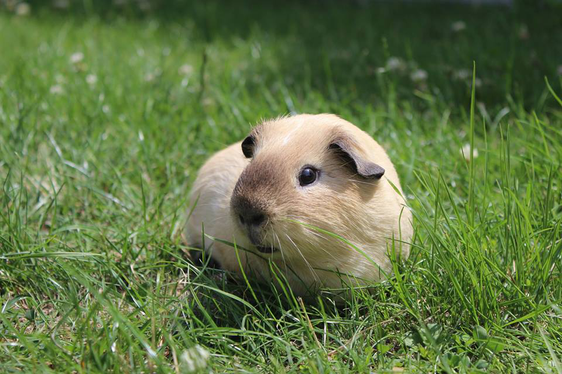

#Introduction

Le cochon d'Inde : *Cavia porcellus* (Linnaeus, 1758) est un rongeur domestique de la famille des Caviidae. Ses cousins sauvages les plus apparentés : *Cavia apparea* ( Erxleben, 1777 ) et *Cavia tschudii* (Fitzinger, 1857) sont originaires d'Amerique du sud. 

Le cochon d'Inde est un animal de compagnie répandu dans le monde entier. Il est également utilisé comme mammifère d'expérimentation dans la recherche biomédicale et est consommé en Amerique du sud.

Comme pour beaucoup d'autres rongeurs, les dents du cochon d'inde grandissent continuellement. L'usure de celles-ci permet donc la régulation leur taille. Il partage avec l'homme la caractéristique de ne pas être capable de synthétiser sa propre vitamine C. 



#But

L'objet de cette analyse est de savoir si la vitamine C sous forme d'acide ascorbique isolé ou sous forme de jus d'orange ont le même effêt sur la croissance des dents du *Cavia porcellus*. Nous nous intéresserons aussi à l'impact de la dose sur la longueur des dents de celui-ci. 

# Matériel et méthode
## Acquisition des données

 Le jeu de donnée " ToothGrowth " provient du journal *The Statistics of Bioassay (1952)* de l'auteur C.I. Bliss. 
 La croissance des dents a été mesurée sur 60 cochons d'inde. Ils ont été séparé en 2 groupes égaux : ceux supplémentés au jus d'orange et ceux supplémentés à la vitamine C isolée. Ils ont également été séparé en 3 groupes selon la dose de vitamine C reçue : 0.5, 1 ou 2 mg/jour
 
## Analyse des données
Le seuil $\alpha$ pour l'ensemble des tests d'hypthèses ci dessous est fixé à 0.05

1) Pour comparer la longeur des incisives des cochons d'Inde en réponse au jus d'orange ou a la vitamine C isolée, nous utilisons le test d'hypothèse : test-t de Student comparant deux groupes d’échantillons indépendants.

Les hypothèses sont : \(H_{0}\) : \(\mu_{1} = \mu_{2}\)
                      \(H_{1}\) : \(\mu_{1} \ne$  \mu_{2}\) 
Les conditions de validités du test sont : 

- Un échantillonnage aléatoire
- Des observations indépendantes les unes des autres

Ces deux conditions sont supposées validées

- Une distribution des résidus qui doit suivre une distribution normale ou approximativement normale : un graphique quantile-quantile de comparaison de la distribution des résidus avec une distribution normale permet d'observer si cette condition est respectée.

Et/ou un grand nombre d'observations

Cette dernière condition sera testée lors de l'analyse statistique.

2) Pour comparer la longueur des incisives des cochons d'Inde en réponse à la dose utilisée, nous utilisons le test d'hypothèse de l'Anova à un facteur

Les hypothèses sont :

$H_{0}$ : $\mu_{1} =  \mu_{2} =  ... = \mu _{p}$

$H_{1}$  :  au moins une des moyennes est différente des deux autres

Les conditions de validité du test sont :

- Un échantillonage aléatoire
- Des observations indépendantes les unes des autres

Ces deux conditions sont supposées validées

- Une distribution normale des résidus : un graphique quantile-quantile de comparaison de la distribution des résidus avec une distribution normale permet d'observer si cette condition est respectée.
- L'homoscédasticité : la variance des erreurs est constante. Cette condition est testée avec le test de de Barlett qui a pour hypothèse : 
$H_{0}$ : Homoscédasticité : $var_{1} = var_{2} = ... = var_{p}$

$H_{1}$  :  Hétéroscédasticité : au moins une variance est différente

Une comparaison multiple de tukey va être utilisée pour comparer les doses de vitamine C 2 à 2. Il s'agit d'une succession de tests de student. 

# Résultats


```{r}
## Recoding ToothGrowth$dose
ToothGrowth$dose <- as.character(ToothGrowth$dose)
ToothGrowth$dose <- factor(ToothGrowth$dose)
```
```{r}
## Recoding ToothGrowth$dose
ToothGrowth$dose <- as.character(ToothGrowth$dose)
ToothGrowth$dose <- factor(ToothGrowth$dose)

```

## Longueur des incisives

### Statistiques descriptives

#### Statistiques descriptives numériques

La moyenne de la longeur des incisives est différente pour les cochons d'inde supplémentés au jus d'orange (OJ) ($20.66333\pm6.605561 mm$) et pour ceux supplémentés à la vitamine C  (VC) ($16.96333\pm8.266029 mm$). 
```{r}
library(dplyr)
ToothGrowth%>%group_by(supp)%>% summarise("mean" = mean(len, na.rm=TRUE), "sd" = sd(len, na.rm=TRUE), "number" = length(len)) -> len_supp

library(knitr)

kable(x = len_supp, format = "pandoc", caption = "Tableau de la longueur des incisives moyenne (mm) des cochons d'inde selon le type de supplémentation ", col.names = c("Supplémentation", "Longueur des dents moyenne", "Ecart-type", "Nombre d'observations"), align = "c")

```


La moyenne de la longeur des incisives est différente pour les cochons d'inde ayant reçu une dose de 0.5 mg/jour ($10.605\pm4.499763 mm$), pour ceux ayant reçu une dose de 1mg/jour ($19.735\pm4.415436 mm$) et pour ceux ayant reçu une dose de 2mg/jour ($26.100\pm3.774150 mm$). 
```{r}
library(dplyr)
ToothGrowth%>%group_by(dose)%>% summarise("mean" = mean(len, na.rm=TRUE), "sd" = sd(len, na.rm=TRUE), "number" = length(len)) -> len_dose

library(knitr)

kable(x = len_dose, format = "pandoc", caption = "Tableau de la longueur des incisives moyenne (mm) des cochons d'inde selon la dose de vitamine C quotidienne reçue ", col.names = c("Dose (mg/jour)", "Longueur des dents moyenne", "Ecart-type", "Nombre d'observations"), align = "c")

```


#### Statistiques descriptives graphiques


La représentation graphique sous forme de boxplot permet de se représenter visuellement sur les 5 nombres : la valeur minimale, le premier quartile, la mediane, le troisième quartile et la valeur maximale. La différence entre les cochons d'indes supplémentés au jus d'orange et ceux supplémentés à la vitamine C isolée n'est pas flagrante sur le graphique.
```{r}
library("ggplot2")
ggplot(data=ToothGrowth) +
  geom_boxplot(mapping=aes(x= as.factor(supp),y=len), fill=c("#26c40d", "#0d6bc4"))+
theme_classic() +
 labs( x = "Supplémentation", y = "Longeur des incisives (mm)", caption = expression(paste("Boxplot de la comparaison de la longueur des incisives des ", italic(" Cavia porcellus "), "selon leur type de supplémentation.")))+
  theme(plot.caption = element_text(hjust = 0.5, size = 10))
```

Le graphique semble nous faire part d'une différence de longueur des incisives des cochons d'Inde pour chaque différence de dosage en vitamine C. 
```{r}
library("ggplot2")
ggplot(data=ToothGrowth) +
  geom_boxplot(mapping=aes(x= as.factor(dose),y=len, fill=dose))+
theme_classic() +
 labs( x = "Dose de vitamine C", y = "Longeur des incisives (mm)", caption = expression(paste("Boxplot de la comparaison de la longueur des incisives des ", italic(" Cavia porcellus "), " en fonction la dose de vitamine C reçue (mg/jour).")))+
  theme(plot.caption = element_text(hjust = 0.5, size = 8))
```

### Statistiques
#### Tests d'hypothèses

##### Test d'hypothèse de student

Ce test sera employé pour comparer les moyennes des longueurs des incisives des cochons d'inde ayant été supplémenté avec du jus d'orange et celles des cochon d'Inde ayant été supplémenté avec de la vitamine C.
```{r}
library(dplyr)
ToothGrowth %>% mutate(len.res = len - ave(len, supp)) -> ToothGrowth
``` 

```{r}
library(tidyverse)
car::qqPlot(ToothGrowth$len.res, distribution = "norm",
  envelope = 0.95, col = "Black", ylab = "Résidus des longueurs des incisives",xlab = "Quantiles de la distribution normale")
```
- Tous les points suivent une distribution normale ( avec une intervale de confiance de 95%). Le premier critère d'application du test-t de student comparant deux groupes d'échantillons indépendants est respecté. 

- Le nombre d'obeservations est suffisant.

-> Le tes-t de student indépendant peut être appliqué.


\(H_{0}\) : \(\mu_{OJ} = \mu_{VC}\)

\(H_{1}\) : \(\mu_{OJ} \ne  \mu_{VC}\) 

```{r}
t.test(len ~ supp, data = ToothGrowth,
  alternative = "two.sided", conf.level = 0.95, var.equal = TRUE)
```
Le degré de confiance est fixé au seuil \(\alpha\) de 0.05
Le seuil de probabilité critique ( p ) est égale à 0.06039
p < 0.05 

On a pas de différence significative entre les moyennes
-> l'hypothèse \(H_{1}\) est à rejeter (avec un degré de confiance de 5%)

##### Test d'hypothèse de l'Anova à 1 facteur

Ce test sera utilisé pour comparer les moyennes des longueurs des incisives des cochons d'Inde en fonction de la dose qu'ils ont reçu (0.5, 1 ou 2 mg/jour)

```{r}
library(tidyverse)
car::qqPlot(ToothGrowth$len.res, distribution = "norm",
  envelope = 0.95, col = "Black", ylab = "Résidus des longueurs des incisives",xlab = "Quantiles de la distribution normale")
```
  Tous les points suivent une distribution normale ( avec une intervale de confiance de 95%). Le premier critère d'application de l'ANOVA à un facteur est respecté. 
  
```{r}
bartlett.test(len ~ dose, data = ToothGrowth)
```
 k^2^ = 0.66547, p = 0.717
 Le degré de confiance est fixé au seuil \(\alpha\) de 0.05
Le seuil de probabilité critique ( p ) est égale à 0.717
p > 0.05 

->  Nous ne pouvons pas rejeter l'hypothèse nulle stipulant que la variance soit la même pour les 3 groupes de cochons d'Inde séparés selon la dose de vitamine C reçue
Il y a homoscédasticité des variances au seuil \(\alpha\) de 0.05


```{r}
anova(anova. <- lm(len ~ dose, data = ToothGrowth))
```
F = 67.416, p = < 9.533e-16

La table d'analyse des variances nous indique donc qu'au moins une des moyennes de longueur d'incisives d'un des 3 groupes de cochons d'inde (séparés selon la dose de vitamine C reçue) est significativement différente au seuil $\alpha$ de 0.05


```{r}
summary(anovaComp. <- confint(multcomp::glht(anova.,
  linfct = multcomp::mcp(dose = "Tukey")))) 
.oma <- par(oma = c(0, 5.1, 0, 0)); plot(anovaComp.); par(.oma); rm(.oma)
```
Le graphique de comparaison multiple de Tukey nous montre qu'il y a une différence significative de longueur des incisives des cochons d'inde au seuil $\alpha$ de 0.05 entre chaque groupe de cochon d'Inde (séparés selon la dose de vitamine C reçue).En effet,  Aucune des intervalles ne passe par la droite verticale en  x=0. La table de comparaison multiple de Tukey confirme ce résultat. 

# Discussion 

Le test-t de Student comparant deux groupes d’échantillons indépendants nous indique que la moyenne de la longueur des incisives des cochons d'Inde ayant été supplémentés avec du jus d'orange ( avec comme valeur moyenne 20.66333 ± 6.605561 mm)  n'est pas significativement différente de la moyenne de la longueur des incisives des cochons d'Inde ayant été supplémentés avec de la vitamine C isolée (avec comme valeur moyenne 16.96333 ± 8.266029 mm). 

L'analyse de la variance des longueurs des incisives des cochons d'inde  suivi d'un test de comparaisons multiples de Tukey indique que la moyenne des longueurs des incisives cochons d'Inde ayant reçu une dose de 0.5 mg/jour de vitamine C, avec une valeur moyenne (10.605±4.499763 mm), est significativement plus petite que que la moyenne des longueurs des incisives cochons d'Inde ayant reçu une dose de 1 mg/jour de vitamine C, avec une valeur moyenne (9.735±4.415436 mm), qui est elle significativement même plus petite que la moyenne des longueurs des incisives cochons d'Inde ayant reçu une dose de 2 mg/jour de vitamine C, avec une valeur moyenne (26.100±3.774150 mm). 

Dans les limites de l'étude concernant les dosages testés, nous pouvons remarquer que le dosage le plus haut est celui auquel est associé la plus grande valeur de moyenne de longueur des incisives. Dans le cadre d'une étude plus complète avec des valeurs à intervalles régulières et plus nombreuses pour la dose de vitamine C,il pourrait être intéressant d'essayer d'effectuer une régression linéaire entre la dose et la longueur des incisives. 

# Conclusion

En conclusion, le dosage de la vitamine C a un impact significatif sur la longueur des incisives des cochons d'Inde mais le type de supplémentation ( jus d'orange ou vitamine C isolée ) n'a pas d'influence significative sur celle-ci.

#  Bibliographies

 - C. I. Bliss, *the Statistics of Bioassay*, 1st Edition
 - http://animaldiversity.org/accounts/Cavia_porcellus/
